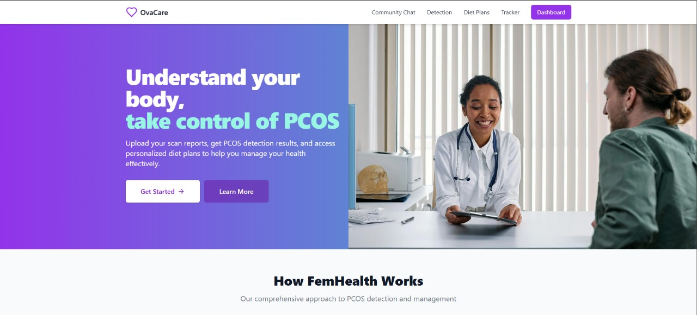
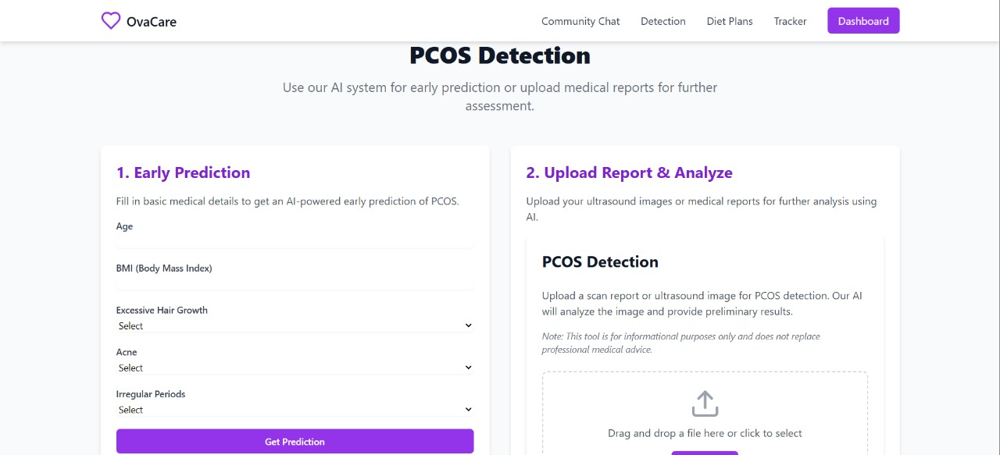
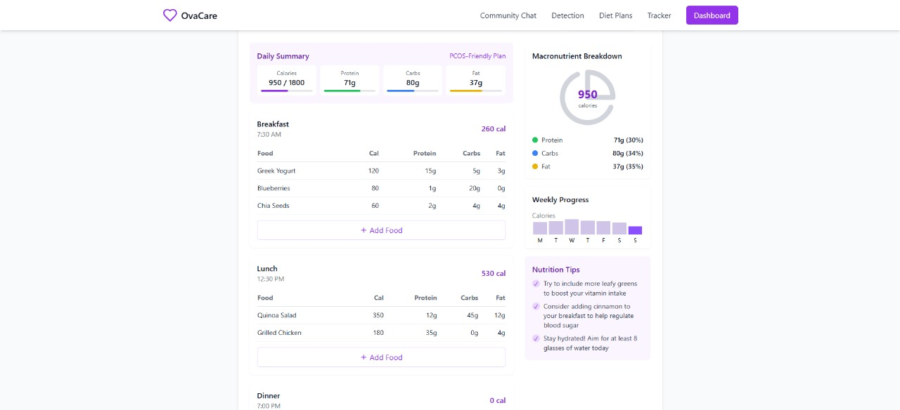

# OvaCare
PCOS detection and wellness support
# 🧠 PCOS Early Detection System (AI + React + Flask)

An intelligent health assistant to detect **Polycystic Ovary Syndrome (PCOS)** early using machine learning. This system uses a React-based frontend and a Flask-powered backend to provide users with a seamless experience for health prediction and awareness.

---

## 🚀 Project Overview

PCOS affects millions of women globally, often going undiagnosed. Our solution uses clinical and lifestyle data to predict PCOS risk with high accuracy, promoting early intervention and awareness.

---

## 🖼 Features

- ✨ User-friendly web interface built with **React**
- 🧠 Machine Learning model built with **scikit-learn**
- 🧪 Accurate predictions using medical and lifestyle data
- 📈 Visual insights into feature importance
- 🌐 Connected via a REST API using **Flask**

---

## 🛠 Tech Stack

- **Frontend:** React, Axios, Tailwind CSS
- **Backend:** Python, Flask, scikit-learn
- **ML Models:** Random Forest, Logistic Regression, SVM
- **Other Tools:** pandas, numpy, matplotlib, seaborn
